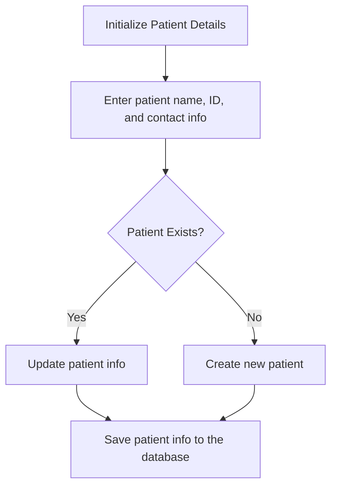
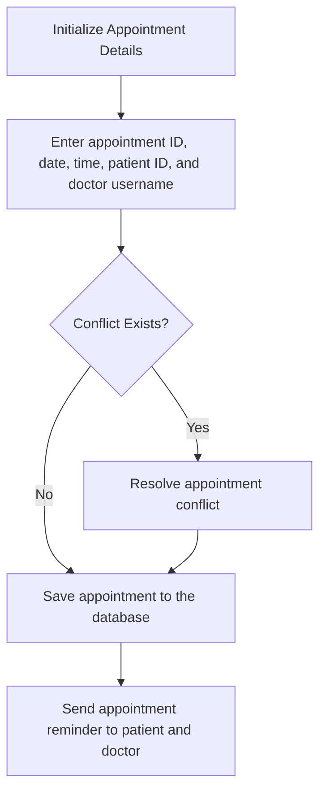
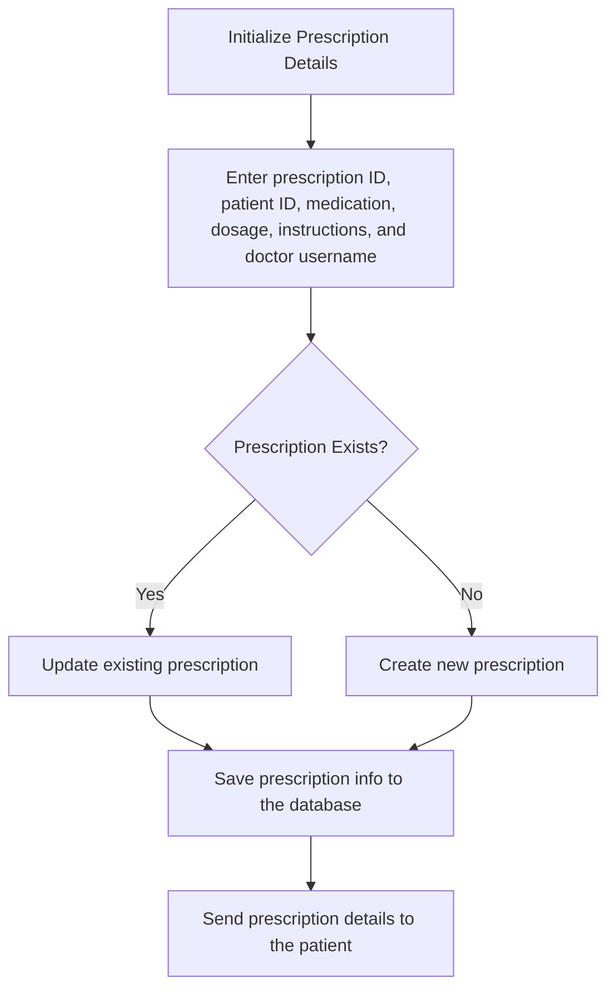
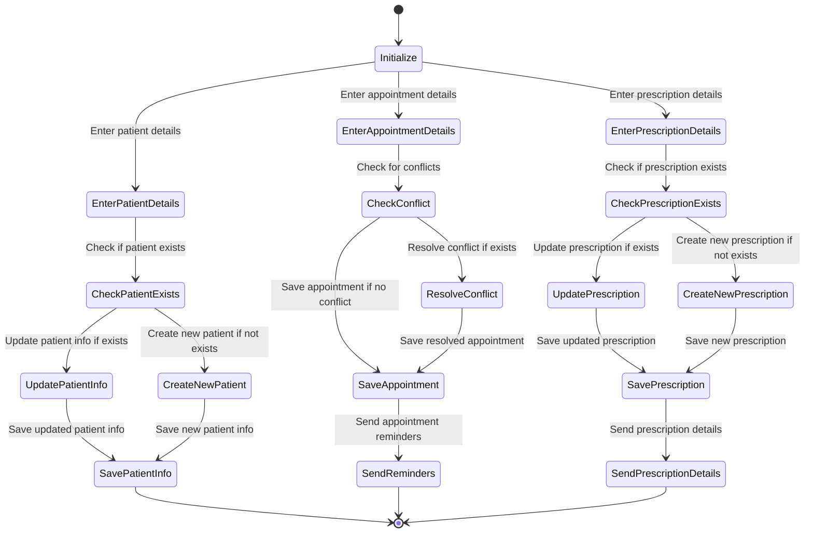

### 3.3 Final Solution

#### Explanation of Final Solution Superiority
This solution stands out due to its comprehensive integration of user roles, simple interface, and extensive feature set to meet the needs of a clinical management system. Below is a comparison table highlighting key aspects where this solution excels over alternative solutions.

| Feature                    | This Solution                                             | Other Solutions                                          |
|----------------------------|-----------------------------------------------------------|----------------------------------------------------------|
| User Roles                 | Separate roles for doctors and receptionists              | Limited or no role separation                             |
| Appointment Management     | Detailed appointment scheduling and viewing capabilities  | Basic or no appointment management                        |
| Prescription Handling      | Efficient prescription management and tracking            | No integrated prescription handling                       |
| Usability                  | User-friendly interface with clear navigation             | Complicated or outdated interfaces                        |
| Expandability              | Designed with future scalability in mind                  | Limited to current features with no expansion options     |

The selection of this solution is based on its ability to provide a holistic and efficient approach to managing clinical operations, thus improving productivity and patient care.

#### 3.3.1 Components
The final solution incorporates several key components, each serving a specific purpose to ensure smooth operation and management of the clinical system. Below is a block diagram (Fig. 1) representing the connectivity and interaction between the components.

**Fig. 1 - Block Diagram of Clinical Management System**

**Components Used:**
1. **User Authentication Module**: Handles login/logout functionality for different user roles.
2. **Appointment Scheduler**: Manages patient appointments, including adding, updating, and viewing appointments.
3. **Patient Management System**: Stores and manages patient information.
4. **Prescription Management System**: Allows doctors to create and manage prescriptions (could be expanded for connecting databases).
5. **Database**: Stores all data securely, including user information, patient details, appointments, and prescriptions.
6. **User Interface (UI)**: Provides an intuitive interface for interaction with the system.

#### 3.3.2 Features

**Table: Features of the Clinical Management System**

| Feature                          | Description                                                                                     |
|----------------------------------|-------------------------------------------------------------------------------------------------|
| User Authentication              | Secure login/logout functionality for doctors and receptionists                                 |
| Appointment Management           | Scheduling, updating, and viewing patient appointments                                          |
| Patient Information Management   | Storing and managing detailed patient records                                                   |
| Prescription Handling            | Creating, updating, and tracking prescriptions                                                  |
| Role-Based Access Control        | Ensuring that users can only access information and functionality pertinent to their role       |
| Intuitive User Interface         | Easy-to-use interface with clear navigation and usability                                       |
| Data Security                    | Secure storage and handling of all sensitive information                                        |

#### 3.3.3 Environmental, Societal, Safety, and Economic Considerations
The engineering design took into account several critical considerations:

**Environmental**:
- Reduced paper use through digital record-keeping, contributing to environmental conservation.
- Energy-efficient software development practices to minimize carbon footprint.

**Societal**:
- Improved patient care through efficient management and streamlined operations.
- Enhanced accessibility to medical records for authorized personnel, improving healthcare delivery.

**Economic**:
- Cost-effective development using open-source technologies.
- Scalable design allowing for future expansion without significant additional costs.

**Safety**:
- Data encryption to ensure patient confidentiality.
- Regular software updates and security patches to protect against vulnerabilities.

## 3.3.4 Test Cases and Results (Solution Implementation)
To ensure the robustness and reliability of the prototype, several test suites were designed:

## Solution Implementation

### MVP Descriptions
| MVP                         | Accounts for                                           | Testing                          | Conclusion                                                                                           |
|-----------------------------|--------------------------------------------------------|----------------------------------|------------------------------------------------------------------------------------------------------|
| 1. Managing Patients        | Adding, Removing, Updating, Viewing, Searching Patients| Unit                             | Works well and allows for basic patient management functionality. More features could improve usability. |
| 2. Scheduling Appointments  | Adding, Removing, Updating, Viewing, Handling Conflicts| Unit, Integration                | Handles scheduling well but could benefit from better conflict resolution and reminders.               |
| 3. Managing Prescriptions   | Adding, Removing, Updating, Viewing Prescriptions      | Unit, Integration, System        | Effective for prescription management but could be enhanced with prescription validation and alerts.    |

### Explanation:
### MVP 1: Managing Patients

Accounts for: Basic CRUD (Create, Read, Update, Delete) operations on patient records.
Testing: Unit tests focus on individual functionalities like adding, removing, and updating patient information.
Conclusion: The system effectively manages patient records but could benefit from additional features for enhanced usability.
### MVP 2: Scheduling Appointments

Accounts for: Scheduling-related functionalities including adding, removing, updating appointments, and handling conflicts.
Testing: Both unit and integration tests ensure that individual functionalities and their interactions are working correctly.
Conclusion: The appointment scheduling system works well but could be improved with better conflict resolution strategies and reminders for appointments.
### MVP 3: Managing Prescriptions

#### Accounts for: Managing prescription-related tasks including adding, removing, updating, and viewing prescriptions.
Testing: Comprehensive tests including unit, integration, and system tests to cover all aspects of prescription management.
Conclusion: The system is effective in managing prescriptions but could be enhanced with features like prescription validation and alert systems for better patient safety.
This table should provide a clear and concise overview of the MVPs, their functionalities, testing methods, and conclusions. If you need further adjustments or additional details, feel free to ask!

## Class Diagram 

### Unit Testing
Unit testing was conducted on all three MVPs, focusing on critical functions that are essential to the system's operation. This includes adding and managing patients, scheduling appointments, and managing prescriptions.

### Control Flow Graphs
#### MVP 1: Managing Patients Control Flow Graph

#### Prime Paths for Managing Patients Control Flow Graph

1. **Path 1:** `1 → 2 → 4`
   - Start → Enter patient name, ID, and contact info → Patient Exists? (Yes) → Update patient info → Save patient info to the database → End

2. **Path 2:** `1 → 3 → 4`
   - Start → Enter patient name, ID, and contact info → Patient Exists? (No) → Create new patient → Save patient info to the database → End

#### MVP 2: Scheduling Appointments Control Flow Graph

#### Prime Paths for Scheduling Appointments Control Flow Graph

1. **Path 1:** `1 → 2 → 3 → 4`
   - Start → Enter appointment ID, date, time, patient ID, and doctor username → Conflict Exists? (Yes) → Resolve appointment conflict → Save appointment to the database → Send appointment reminder to patient and doctor → End

2. **Path 2:** `1 → 3 → 4`
   - Start → Enter appointment ID, date, time, patient ID, and doctor username → Conflict Exists? (No) → Save appointment to the database → Send appointment reminder to patient and doctor → End

#### MVP 3: Managing Prescriptions Control Flow Graph

#### Prime Paths for Managing Prescriptions Control Flow Graph

1. **Path 1:** `1 → 2 → 4 → 5`
   - Start → Enter prescription ID, patient ID, medication, dosage, instructions, and doctor username → Prescription Exists? (Yes) → Update existing prescription → Save prescription info to the database → Send prescription details to the patient → End

2. **Path 2:** `1 → 3 → 4 → 5`
   - Start → Enter prescription ID, patient ID, medication, dosage, instructions, and doctor username → Prescription Exists? (No) → Create new prescription → Save prescription info to the database → Send prescription details to the patient → End

## Prime Paths
Prime paths are a set of paths that cover all possible scenarios in the control flow graphs for each MVP. These paths ensure comprehensive testing of all functionalities. A  Summary of Prime Paths in Numbers are as follows:

### Managing Patients:
1. Path 1: `1 → 2 → 4`
2. Path 2: `1 → 3 → 4`

### Scheduling Appointments:
1. Path 1: `1 → 2 → 3 → 4`
2. Path 2: `1 → 3 → 4`

### Managing Prescriptions:
1. Path 1: `1 → 2 → 4 → 5`
2. Path 2: `1 → 3 → 4 → 5`

## Test Paths and Test Cases
Test cases were derived from the prime paths to ensure that all critical paths in the control flow graphs are tested. This includes both positive and negative test cases to cover all edge cases and potential issues.

### Test Cases Table

| **MVP**                   | **Test Case**                         | **Path**           | **Description**                                                         | **Steps**                                                                                                 | **Test Values**                                                                                              | **Expected Result**                                                                                            |
|---------------------------|---------------------------------------|--------------------|--------------------------------------------------------------------------|-----------------------------------------------------------------------------------------------------------|---------------------------------------------------------------------------------------------------------------|----------------------------------------------------------------------------------------------------------------|
| Managing Patients         | Update Existing Patient Info          | `1 → 2 → 4`        | Update an existing patient's information                                 | 1. Enter patient name, ID, and contact info (existing patient) 2. Check if the patient exists 3. Update patient info 4. Save patient info to the database         | Patient Name: John Doe Patient ID: P001 Contact Info: 555-1234 New Contact Info: 555-5678             | The patient's info is successfully updated and saved in the database.                                           |
| Managing Patients         | Create New Patient                    | `1 → 3 → 4`        | Create a new patient                                                     | 1. Enter patient name, ID, and contact info (new patient) 2. Check if the patient exists 3. Create new patient 4. Save patient info to the database             | Patient Name: Jane Smith Patient ID: P002 Contact Info: 555-0000                                         | The new patient's info is successfully created and saved in the database.                                       |
| Scheduling Appointments   | Resolve Appointment Conflict          | `1 → 2 → 3 → 4`    | Resolve a conflict when scheduling an appointment                        | 1. Enter appointment ID, date, time, patient ID, and doctor username 2. Check if a conflict exists 3. Resolve the conflict 4. Save appointment to the database 5. Send appointment reminder to patient and doctor | Appointment ID: A001 Date: 2024-07-10 Time: 10:00 AM Patient ID: P001 Doctor Username: doc1        | The appointment conflict is resolved, and the appointment is saved and reminders are sent.                      |
| Scheduling Appointments   | Save Appointment without Conflict     | `1 → 3 → 4`        | Save an appointment without any conflicts                                | 1. Enter appointment ID, date, time, patient ID, and doctor username 2. Check if a conflict exists 3. Save appointment to the database 4. Send appointment reminder to patient and doctor | Appointment ID: A002 Date: 2024-07-11 Time: 11:00 AM Patient ID: P002 Doctor Username: doc2        | The appointment is saved and reminders are sent without any conflicts.                                          |
| Managing Prescriptions    | Update Existing Prescription          | `1 → 2 → 4 → 5`    | Update an existing prescription                                          | 1. Enter prescription ID, patient ID, medication, dosage, instructions, and doctor username 2. Check if the prescription exists 3. Update existing prescription 4. Save prescription info to the database 5. Send prescription details to the patient | Prescription ID: RX001 Patient ID: P001 Medication: Ibuprofen Dosage: 200mg Instructions: Take twice daily Doctor Username: doc1 New Dosage: 300mg | The existing prescription is updated, saved in the database, and details are sent to the patient.              |
| Managing Prescriptions    | Create New Prescription               | `1 → 3 → 4 → 5`    | Create a new prescription                                                | 1. Enter prescription ID, patient ID, medication, dosage, instructions, and doctor username 2. Check if the prescription exists 3. Create new prescription 4. Save prescription info to the database 5. Send prescription details to the patient | Prescription ID: RX002 Patient ID: P002 Medication: Paracetamol Dosage: 500mg Instructions: Take thrice daily Doctor Username: doc2 | The new prescription is created, saved in the database, and details are sent to the patient.                   |

# Integration Testing

## Def-Use Graphs

### Managing Patients Def-Use Graph

### Scheduling Appointments Def-Use Graph

### Managing Prescriptions Def-Use Graph

## DU Paths and Test Cases

### DU Paths for Managing Patients

**DU Path 1:** `Initialize Patient Details -> Enter patient name, ID, and contact info -> Patient Exists? -> Update patient info -> Save patient info to the database`

**DU Path 2:** `Initialize Patient Details -> Enter patient name, ID, and contact info -> Patient Exists? -> Create new patient -> Save patient info to the database`

### Test Cases for Managing Patients

| **Test Case**                         | **Path**                          | **Description**                                                         | **Test Values**                                                                                              | **Expected Result**                                                                                            |
|---------------------------------------|-----------------------------------|--------------------------------------------------------------------------|---------------------------------------------------------------------------------------------------------------|----------------------------------------------------------------------------------------------------------------|
| Update Existing Patient Info          | Initialize -> Enter -> Exists? -> Update -> Save | Update an existing patient's information                                 | Patient Name: John Doe, Patient ID: P001, Contact Info: 555-1234, New Contact Info: 555-5678                   | The patient's info is successfully updated and saved in the database.                                           |
| Create New Patient                    | Initialize -> Enter -> Exists? -> Create -> Save | Create a new patient                                                     | Patient Name: Jane Smith, Patient ID: P002, Contact Info: 555-0000                                             | The new patient's info is successfully created and saved in the database.                                       |

### DU Paths for Scheduling Appointments

**DU Path 1:** `Initialize Appointment Details -> Enter appointment ID, date, time, patient ID, and doctor username -> Conflict Exists? -> Resolve appointment conflict -> Save appointment to the database -> Send appointment reminder to patient and doctor`

**DU Path 2:** `Initialize Appointment Details -> Enter appointment ID, date, time, patient ID, and doctor username -> Conflict Exists? -> Save appointment to the database -> Send appointment reminder to patient and doctor`

### Test Cases for Scheduling Appointments

| **Test Case**                         | **Path**                                             | **Description**                                                         | **Test Values**                                                                                              | **Expected Result**                                                                                            |
|---------------------------------------|------------------------------------------------------|--------------------------------------------------------------------------|---------------------------------------------------------------------------------------------------------------|----------------------------------------------------------------------------------------------------------------|
| Resolve Appointment Conflict          | Initialize -> Enter -> Conflict Exists? -> Resolve -> Save -> Send | Resolve a conflict when scheduling an appointment                        | Appointment ID: A001, Date: 2024-07-10, Time: 10:00 AM, Patient ID: P001, Doctor Username: doc1                | The appointment conflict is resolved, and the appointment is saved and reminders are sent.                      |
| Save Appointment without Conflict     | Initialize -> Enter -> Conflict Exists? -> Save -> Send | Save an appointment without any conflicts                                | Appointment ID: A002, Date: 2024-07-11, Time: 11:00 AM, Patient ID: P002, Doctor Username: doc2                | The appointment is saved and reminders are sent without any conflicts.                                          |

### DU Paths for Managing Prescriptions

**DU Path 1:** `Initialize Prescription Details -> Enter prescription ID, patient ID, medication, dosage, instructions, and doctor username -> Prescription Exists? -> Update existing prescription -> Save prescription info to the database -> Send prescription details to the patient`

**DU Path 2:** `Initialize Prescription Details -> Enter prescription ID, patient ID, medication, dosage, instructions, and doctor username -> Prescription Exists? -> Create new prescription -> Save prescription info to the database -> Send prescription details to the patient`

### Test Cases for Managing Prescriptions

| **Test Case**                         | **Path**                                            | **Description**                                                         | **Test Values**                                                                                              | **Expected Result**                                                                                            |
|---------------------------------------|-----------------------------------------------------|--------------------------------------------------------------------------|---------------------------------------------------------------------------------------------------------------|----------------------------------------------------------------------------------------------------------------|
| Update Existing Prescription          | Initialize -> Enter -> Exists? -> Update -> Save -> Send | Update an existing prescription                                          | Prescription ID: RX001, Patient ID: P001, Medication: Ibuprofen, Dosage: 200mg, Instructions: Take twice daily, Doctor Username: doc1, New Dosage: 300mg | The existing prescription is updated, saved in the database, and details are sent to the patient.              |
| Create New Prescription               | Initialize -> Enter -> Exists? -> Create -> Save -> Send | Create a new prescription                                                | Prescription ID: RX002, Patient ID: P002, Medication: Paracetamol, Dosage: 500mg, Instructions: Take thrice daily, Doctor Username: doc2 | The new prescription is created, saved in the database, and details are sent to the patient.                   |

# System Testing

System Testing was done on the entire Dental Clinic Management System. To accomplish this, we extracted a Finite State Machine and used node coverage, a form of graph coverage, to test it. We did not use logic coverage since we did not have hardcoded predicates to guard the transition between states. If we did have predicates dictating the transition in our code, we would have used logic coverage.

## Finite State Machine

## ECLIPSE Test Cases & Test Coverages
Now that we have all the theoritical components and the diagrams in place, it is time to check our tests on Eclispse, which the whole point of our project.

### JUnit test 
The JUnit test for our test folder in the project shows that we have 71 tests that run wih no errors or failures.

### Test Coverage
The test coverage is arguably the most important part of testing our code for the project. Below you can see that we achieved a 100% test coverage on most files. You can also check each percentage for each file in the folder called `Test Coverage` in this repository.

- **User.java Test Coverage (80%)**
  - The test coverage for `User.java` reached 80%.
  - This was because the tests included checks for passwords, which are hardcoded.
  - Testing password-related functionality was deemed unnecessary since we are not connected to a backend database like MySQL.

- **Appointment.java Test Coverage (98.6%)**
  - The test coverage for `Appointment.java` achieved 98.6%.
  - We did not achieve 100% coverage due to the nature of a function within the class. This function compares two appointments and returns    true if they are identical or false if they are different. It also checks if any individual components within each appointment are the      same. However, since the initial comparison often returns true, the checks for individual components do not proceed further.

- **Main Method Test Coverage (0%)**
  - We did not test the main method as it is uncommon and unnecessary.
  - Consequently, the main method shows 0% coverage.

- **Overall Test Coverage (99.1%)**
  - Despite the above points, we reached an overall test coverage of 99.1% for our test cases.

#### 3.3.5 Limitations
Despite its strengths, the solution has some limitations:

- **Scalability**: While designed to be scalable, the current implementation may face performance issues with a significantly large user base.
- **User Training**: very simple training is required for users to fully utilize the system’s capabilities.
- **Integration**: Limited integration with other third-party healthcare systems, which could restrict interoperability, especially if our plan was to be used for the university, we would connect a large database with thousand of students, which could be a potential problem.

